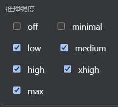

English | [中文](README.zh.md)

# dsh-better-api

An enhanced **Models settings** plugin for the DSH Web GUI: per-model **reasoning strength** (reasoningEfforts) editing for your custom models.

The official models settings page ships no reasoning-effort control. This plugin adds it to the official model-catalog editor:

- Each model row gains a **Reasoning strength** checkbox group: `off / minimal / low / medium / high / xhigh / max`
- Checked levels are written into the model's `reasoningEfforts` (levels are sent under their own name; `off` is special-cased to "send no parameter")
- Unchecking everything removes the declaration, so the model falls back to "no reasoning" and no misleading control is shown
- Hand-declared custom models (OpenAI-compatible gateways, etc.) now get an **Effort** menu in the conversation model picker (provider default + the declared levels); picking one persists it as the session default

Forked from the official [@deepseek-ai/dsh-client-ui-settings-models](https://github.com/deepseek-ai/deepseek-harness) (MIT) with only this editing capability added; everything else behaves like the official plugin.

<p align="center"></p>

## Features

- Settings → Models → any provider → model catalog → expand a model row → check reasoning levels
- Also available while creating a new custom provider
- Full en/zh UI copy
- Writes land in the settings document (e.g. `~/.dsh/settings.yaml`) on save — no restart required

## Install

```bash
cd ~/.dsh/profiles/web
npm i github:131CDA1/dsh-better-api
# merge the repo-root cordis.patch.yml into this profile's cordis.patch.yml
```

or directly:

```bash
dsh plugin --profile web add github:131CDA1/dsh-better-api
```

### Why must the official models settings page be disabled?

This plugin and the official one share the same `settings.section#models` slot; enabling both throws a duplicate-registration error.
This plugin is an enhanced replacement for the official models settings page — the bundled patch disables the official row
(`ui-settings-models` / `@deepseek-ai/dsh-client-ui-settings-models`) automatically; if you install manually, disable that row in the plugin inventory first.

## Does it conflict with other plugins?

**No conflict with API proxy / relay / usage plugins.**

## Usage

1. Open **Settings → Models**, expand your provider card (e.g. custom `gpt`).
2. In **Models**, expand a model row (advanced area) and check the reasoning levels you want.
3. Click **Apply**.
4. Back in a conversation, select that model — the **Effort** menu now shows the declared levels.

## Config reference (settings.yaml)

`reasoningEfforts` declares a model's selectable thinking levels: each key is a level selectors offer, its value the spelling dispatch sends on the wire (`low: low` passes the canonical name through; `max: ultra` renames it for a gateway with its own vocabulary). Keys come from the level set `off / minimal / low / medium / high / xhigh / max`; a level not declared is not offered.

```yaml
llm-pi-ai:
  providers:
    gpt:
      apiKeyEnv: GPT_API_KEY
      api: openai-completions
      baseURL: https://api.example.com
      models:
        - id: gpt-5.6-sol
          name: GPT-5.6 Sol
          reasoningEfforts:
            low: low
            medium: medium
            high: high
```

- `off` is the one three-state key: declared with no value (`off:`) offers Off and sends no parameter when selected; declared with a value (`off: none`) sends that value.
- Once declared, the declaration is the whole offer — restate every level you want to keep.
- For gateways with their own vocabulary, change the value (e.g. `max: ultra`) — no UI change needed.

## License

MIT. Fork of [@deepseek-ai/dsh-client-ui-settings-models](https://github.com/deepseek-ai/deepseek-harness); upstream copyright retained.
